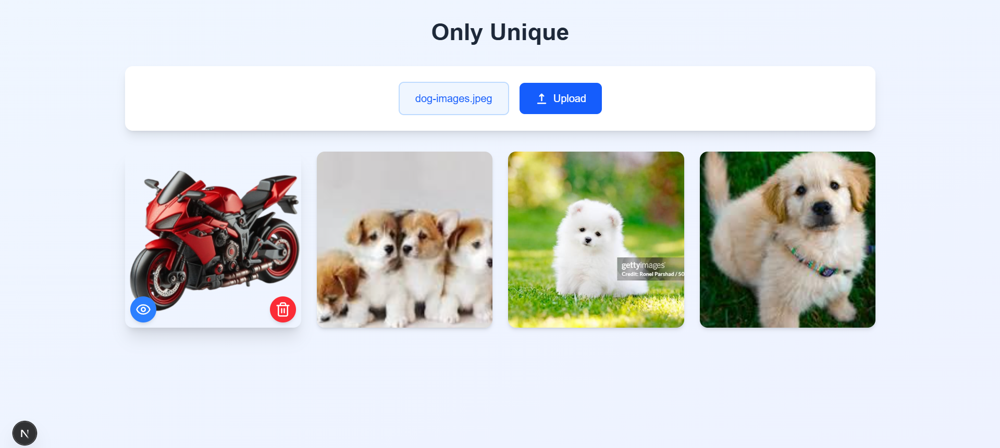

# Image Deduplication & Viewer

This project is a web-based image deduplication system using FastAPI for the backend and Next.js for the frontend. It detects and stores unique images while preventing duplicates using FAISS (Facebook AI Similarity Search) and ResNet50 for feature extraction.

---

## 📌 Features
- Upload images and check for duplicates
- Store only unique images
- View stored images in a responsive gallery
- Delete images from the storage
- Preview images in full-screen mode

---

## 🛠️ Tech Stack
### Backend:
- FastAPI
- FAISS (Facebook AI Similarity Search)
- TensorFlow & ResNet50
- OpenCV & PIL
- Pickle for persistent storage

### Frontend:
- Next.js
- Tailwind CSS
- React

---

## 🚀 Getting Started

### 1️⃣ Clone the Repository
```sh
git clone https://github.com/yourusername/image-deduplication.git
cd image-deduplication
```

### 2️⃣ Backend Setup (FastAPI)

#### Install dependencies:
```sh
cd backend
pip install -r requirements.txt
```

#### Run the FastAPI server:
```sh
uvicorn classifier:app --reload
```

The API will be available at `http://127.0.0.1:8000`

---

### 3️⃣ Frontend Setup (Next.js)

#### Install dependencies:
```sh
cd frontend
npm install
```

#### Run the development server:
```sh
npm run dev
```

The frontend will be available at `http://localhost:3000`

---

## 📡 API Endpoints
### Upload an Image
```http
POST /upload/
```
Uploads an image and checks if it is unique before storing it.

### Retrieve Stored Images
```http
GET /images/
```
Fetches the list of stored unique images.

### Delete an Image
```http
DELETE /delete/{filename}
```
Removes an image from storage and FAISS index.

---

## 📸 Screenshots

| Gallery View | Image Preview |
|-------------|--------------|
|  |  |


---

## 🏗️ Future Enhancements
- Add user authentication
- Implement cloud storage (AWS S3, Firebase, etc.)
- Improve duplicate detection threshold tuning

---

## 🤝 Contributing
Pull requests are welcome! Feel free to contribute and improve this project.

```sh
git checkout -b feature-branch
git commit -m "Add new feature"
git push origin feature-branch
```
Then create a Pull Request (PR) on GitHub!

---

## 🌟 Acknowledgments
Special thanks to open-source contributors and the AI community for making projects like this possible!

